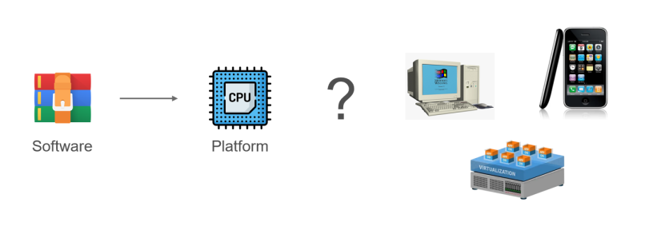

+++
title = "The Evolving Landscape of Software Deployment"
date = 2025-04-29
description = "Short walk through the history of software app platforms. Starting with the desktop in the 1980s, through the Web in 1995, concluding with containers in 2013."

[extra]
subtitle = "A Journey Through Platforms"
+++

I was asked to give a lecture for the students of software engineering at the Faculty of Applied Informatics of
Thomas Bata University. Usually, coming up with at topic that is both engaging and accessible to students is hard
but I needed not think too hard this time. I decided to prepare a guided tour of different platforms where
software applications are deployed looking also at the historical development. I traverse this landscape quite
often in my professional life and it is one of my favourite subjects. I wrote this post primairly to structure
my thoughts ahead of the lecture and I hope some visitor of my blog will find them interesting.

The platforms I was able to fit into my lecture are shown as points on the timeline below.

Before I start the journey through time and discuss the specifics of the individual platforms, I would like
to point out the common themes of my thoughts on them.

* __Deployment__ - Quite often, we developers tend to think only in terms of code. We care about correctly capturing
  the business logic of a given problem and if our code builds sucessfuly and all tests pass we tend to think our job
  is over. But our code would not be useful to anybody if it was not deployed methodically to a specific platform.
  In this context, what matters most is how the fruit of our labor - a software package, is actually executed
  by the target. Sometimes, we have to think all the way down to how instructions will be passed to a processing unit
  capable of understanding them. For a new software product, one that still exists as a mere idea, it is very
  important to choose a destination platform to be able to reach as many users as possible and to best satisfy their
  requirements.

* __Changes over time__ - From the point of view of developers, new platform models pop up from time to time. Since none
  of the major ones disappeared yet, engineers need to stay informed on what are the possible destinations for
  the software they develop.

* __Automation__ - Although older models are still relevant today, it is clear that the younger ones are more
  advanced in a particular aspect. Namely in the potential for automation of various tasks and processes in software
  development like automated builds, CI/CD, orchestration, scaling and so on. In certain scenarios, the demands
  placed on a software service may be such that deploying to an advanced platform is neccessary.

## 1980- Desktop

While applications ran locally on personal computers with terminal interfaces in the late 1970s and early 1980s,
it was only in 1984 with the release of Macintosh and Windows 1.0 in 1985 when desktop computing became
more accessible through graphical user interfaces and 'windows'.

In the beginnings, software applications were distributed on physical media such as floppy discs and later CDs. The
foundational language was of course C, but later higher-level languages came to be used. On Windows, it was C++ which
was first endorsed there as Microsoft C/C++ 7.0 in 1992 and was assisted by the Microsoft Foundation Class Library (MFC) 1.0.
Macintosh adopted an another language building upon C called Objective-C which first appeared in 1986.

Eventually, languages and frameworks abstracting away low-level details of the underlying machine architecture were
developed. In 2000, C# was released for Windows as a part of the .NET framework. More ergonomic UI frameworks
like WPF (2006) became available drawing on the expressive power of C# .NET. A similar evolution occurred within the
Apple ecosystem. Swift, introduced in 2014, represented a modern, safer, and more performant language that, like C#,
enabled the development of more powerful and intuitive user interfaces on macOS. Following Swift's arrival,
Apple continued to evolve its UI frameworks, with SwiftUI, introduced in 2019, offering a declarative and more
developer-friendly approach to building applications across all Apple platforms. In terms of media, the majority of
software is now delivered virtually via installers pulled from the network.

So, how is the desktop model holding up in the present time? Well, there are stil scenarios where it is the only
viable option. For one it is when low-level interaction with hardware is crucial - video games and 3D rendering in general.
Another such scenario is where it is paramount to stay close to the OS API, e.g. to be able to interact with
hardware devices through a full featured interface.

There are also major drawbacks. Most importantly, there is no environment isolation when deploying software to a
desktop platform. Files and configuration values are added to existing piles of data and there is always a risk
of unwanted interaction with some program installed earlier. This is exactly the major chore associated with
developing installation scripts which are almost always neccessary for a developer to be able to ship software
for desktop. The possibility of failure with installation scripts is pretty high.

## 1995- Web

There is a long chain of technology leading to the invention of the World Wide Web and I will not recount
all of it. The landmark achievement was the development of key application layer technology (HTML, HTTP, URL)
by Sir T. B. Lee in CERN in the year 1990. The marriage of hypertext with the internet protocol lowered
the bar for massive information exchange over the internet and paved way for the commercialization of the
web in 1995.

In the early days, web content was static in the form of home pages of various organizations serving
purposes of simple information lookup. However, around the same time, technologies bringing interactivity and
dynamic behavior like JavaScript began to appear, with PHP gaining significant traction in the following years.
This set the stage for the development of web applications. With them, an entirely new class of software deployment
models called _SaaS_ appeared.

In this model, the application lives on a server and its users interface with it through a web browser. We will touch
on this in more detail later in this article.

Over time, dynamic web application development came to be dominated by powerful JavaScript frameworks like React (2013)
and Angular (2016). The development of WebAssembly in 2017 opened a possibility of using any compliant
programming language and framework to develop for the web, e.g. the Blazor .NET framework (2018).

As opposed to the desktop model discussed earlier, web applications are deployed to an isolated environment
(server code to machine under dev control with the client code contained in a browser). This greatly limits
the risk of clashes with other software on the client device (PC or mobile). The life of a deployment engineer is
made much easier with the server environment fully under their control. An another benefit is not having to worry
about versioning of the distributed software. With a web application, the version is determined by what is deployed
on the server.

The web model has its drawbacks however. When faced with a new feature request, we may find that the
browser API is lacking. A problem of this kind is likely to be encountered when a more direct access to the client
hardware is needed, e.g. when a GPU needs to be utilized for heavy processing on the client side.

## Trend from On-premise to SaaS

In the last section, I briefly spoke about a new class of software applications called Software-as-a-service (SaaS)
appeared with the advancement of web. Consider the Amazon web marketplace launched in 1994 or web-based email applications
like Gmail in (2004) as examples.

To understand the major shift, let's first look at the on-premise model illustrated by the following diagram:

As explained in the desktop part of this article, the fundamental problem lies in the fact that
we are giving out the software to users to install on their machine. We cannot control what
happens with the software in these environments. Here are the typical issues in more detail:

* There is always a risk of unwanted interaction of the user with the software artifacts (killing a dependency process,
  deleting a DLL).
* Trouble also comes when we want to automate the deployment, e.g. through regular updates. For this we need to develop
  a proprietary update channel or deploy the application through a store.
* On-premise software is hard to monetize accurately as the moment of delivery is understood by
  clients as transfer of ownership of the software. It is harder to introduce regular payments for
  a service.
* Debugging an issue based on a bug report from the field is quite hard as it is almost impossible to reproduce
  the exact environment and the customer will not easily let the developers access their machine for an investigation.

Now look at the SaaS model:

Clients reach for the service via internet and the application runs in an isolated environment of the server
and browser. Instead of having to deal with an unbounded number of runtime environments
of our applications, we only need to focus on these two.

## 2000- Virtual Machines

In 1999, VMware was the first company to sucessfuly virtualize the x86 architecture. Virtual machines represent
a key step towards fluid management of computing resources for different tasks. In the early days, we had
mostly hypervisors of the second kind (processes in a host OS). Eventually hypervisors of the first kind were
also introduced like VMware ESX (2001, ESXi 2010) and Hyper-V (2008).

Another curious fact is roughly at the same time, programming languages building on top of thick runtimes
abstracting away the details of the computing platforms were developed like Java in 1996 and C# in 2000. In some way we
can think about the JVM and .NET runtime as virtual machines processing abstract instructions.

With the advent of VMs, system administrators received a powerful tool for managing software operations. A tool
that allowed them to run multiple machines on top of a single piece of hardware and easily manage the resources
allocated to them. Additionaly, concepts like snapshots and templates became an essential tool for managing backups
and on-demand scaling. With VMs, it became easier to manage automated workflows in software development like
nightly and CI builds.

One disadvantage of VMs that is becoming increasingly problematic is that as full-fledged
computers, albeit virtual, they are still too cumbersome in certain scenarios. Another important drawback is that
a virtual machine represents a coarse grain in the context of infrastructure. It is harder to achieve modern
orchestration and scaling with them.

## 2007- Mobile

I still remember when my cousin brought his new iPhone 1 to a family gathering shortly after its release. In a time
when everybody had cellulars with little screens and big buttons, having a phone dominated by a touchscreen felt out
of the world. Soon however, all phone manufacturers followed with the most powerful competitor to Apple being
Google with the Android (2008) phone families. A second major constraint for mobile devices is that they are
battery powered resulting in a demand for less power-hungry chips and architectures like ARM.

Compared to desktop, using software on a phone felt much more streamlined. It was obvious that the platform was
designed to be used by anybody, not requiring specific technical skills to be able to manage it. Interaction with
software was greatly simplified through its delivery via an application store (App Store, Google Play) and apps
became the main access points to workflows. Management of files and the OS intrinsics by the user is virtually
non-existent on mobile platforms. This is enabled by more powerful and comprehensive APIs which enable
better management of application access rights, or multimedia sharing between them.

## 2013- Containers

The last platform I will visit in this post is containers, specifically based on Docker (2013) which has
almost become a synonym for container technology. The most important thing to know about containers compared to virtual
machines is that the virtualization happens at the OS level. Containers operate based on isolation of processes
and resources through API functions of the Linux kernel.

Spinning up a container is a much cheaper operation than starting a VM and this is utilized in advanced automation
workflows handling increased loads and scaling of in demand services. In other words containerized software is much easier
to orchestrate through a technology like Kubernetes (2014) or Docker Swarm. Higher order operators on containers
like Kubernetes represent an important step in the evolution of how we deploy software. The hard truth is that some
software, e.g. a service available to billions of users, must be managed through an automated agent as the task would
be too complex for a human to handle.

Containers also facilitate advanced automation of software development processes, for example having your development
environment automatically synchronized by DevContainers and by building CI/CD pipelines where individual stages run
in containers. As containers and technologies like Kuberentes represent a science on their own, the high complexity
associated with them is the main disadvantage and their management requires expert qualifications.

As a key ingredient in cloud-native software, containers are the backbone of many publicly available services and
of what the general public would describe as "the cloud'. I want to leave one interesting side note: the space of cloud
native software is dominated by the Go programming language created by Google in 2009.

## Trend from Installation to Containerization

A second trend I observe is from Intallation to Containerization. I believe it is driven by struggles to avoid
issues typically encountered when installing software directly to some machine (in the host OS environment). When
software is installed, files are placed among other files, configuration values are written next to other values
and the absence of isolation sets the stage for a conflict. Furthermore processes running directly on the host
share a pool of resources like memory or ports and access it almost without restriction.

These problems are addressed by containerzation. The main vector of deployment in this model is a
container image which groups together all the files, configuration values and external interfaces in a single
software package that is ready to be plugged in to the host OS by the container runtime. The resources available
to the container can be controlled by the administrator and the runtime will not allow any excesses.

The unfortunate truth is that an installer is almost always proprietary and yours to manage and develop. Another
severe problem is that at any time somebody reaches for your software, the error-prone installation process
starts again and again. Also, do not forget that what was installed, needs to be able to uninstall itself
and do the cleanup. Therefore, you are not maintaining just the installer, but also an uninstaller doubling
the potential for errors. The situation gets even more difficult if your software depends on other components that
need to be installed.

All the above woes are again remedied by containerization for nothing is installed, but simply started from the
container image. This image is created just once and if there are any problems, you will know at the time it is built.
There is no need to manage unintsallation and cleanup as the container is simply shut down and the resources are
freed. Orchestration operators like Kubernetes and Docker Compose manage dependencies pretty easily.

## Final Remarks

* This article explored 5 different software platforms - Desktop, Web, VM, Mobile and Containers
* I did my best to show their strong and weak points to be considered when designing new software
* For a software architect, it is important to maintain overview as none of them is going away any time soon
* I described two trends that I observe and tried to explain why I believe they exist
  * The trend of going from desktop to the web
  * Moving from installation to containerization