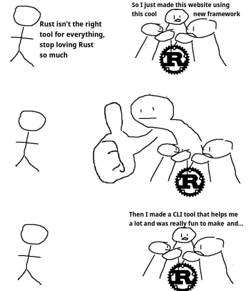
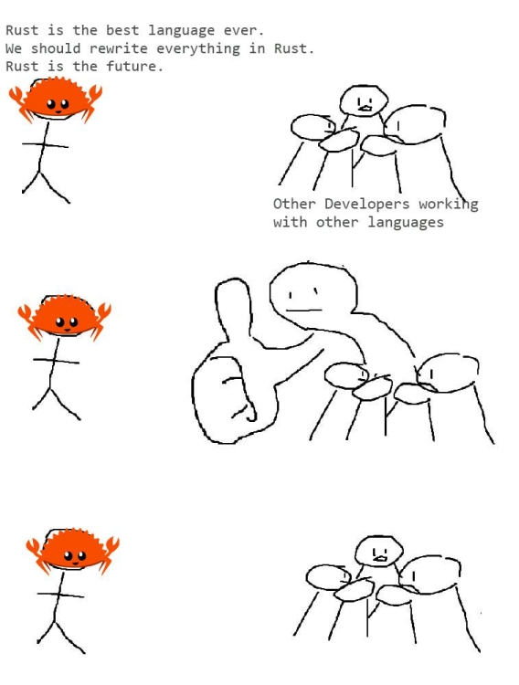
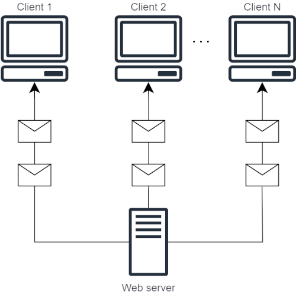
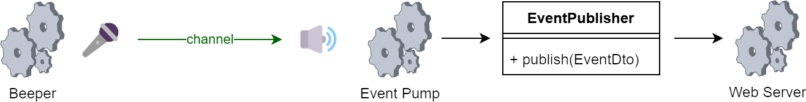
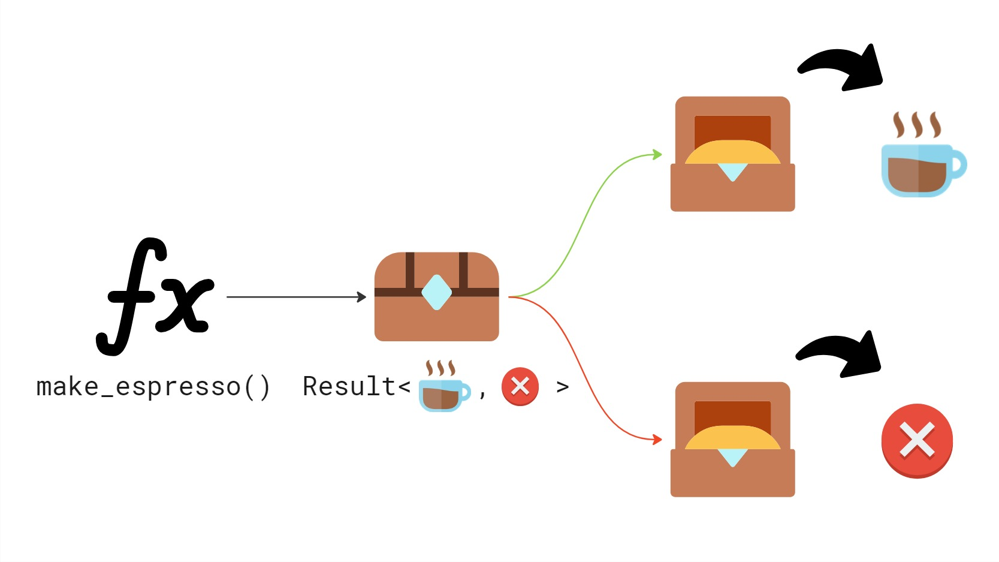

+++
title = "Advantages of Rust 'Nobody Talks About'"
date = 2026-03-29
description = "While performance and memory safety dominate the public debate, Rust offers a wealth of 'hidden' benefits. This article explores how features like fearless concurrency, a unified ecosystem, and explicit error handling provide a level of confidence and productivity rarely found in other languages."
+++

## A Hot Debate

In the title of this post, I claim boldly that there are advantages of Rust 'nobody talks about'.
It is of course a slight exaggeration. I am sure there are other people who see the same set of
benefits to developing in Rust. However, I wanted to contrast the points that you will find
in this article with those I feel take up most of the public debate about Rust - performance and
security.

As one extreme in the debate I see people who reject Rust only because they do not need these
two particular benefits and refuse to consider other advantages. Just recently, I found a nice
meme on Reddit which captured this position perfectly:



But now for a twist! I consider those who feverishly push Rust everywhere just on the back of it being fast and robust
to be equally difficult. I made the following picture from the same template to complement the first one.



I like to think I am not like them since I like to talk about things I build in Rust with whoever
is interested and try not to force anything onto anybody. That is why, in this blog post, I will
avoid direct comparison of Rust to other programming languages. My aim is to put out fires, not
start more of them. I will also leave out the two most often mentioned advantages - performance and memory safety.

Let's focus on advantages that 'nobody talks about':

1. Fearless Concurrency
2. Thriving Ecosystem and Community
3. Powerful Macros and Generics
4. Error Handling

## A Demonstration

I believe presenting only theory is not enough to build a strong case for Rust in the above aspects.
I wanted every reader to be able to experience the points first-hand, so I prepared a small
[demo crate](https://github.com/marekpsenka/rust-advantages/tree/main/example-server). It is the
origin of most code samples presented below.

I picked the topic of [Server-sent Events (SSE)](https://developer.mozilla.org/en-US/docs/Web/API/Server-sent_events)
for the demonstration, because I implemented this infrastructure for a client-server application
with a Rust backend recently. That was when I truly appreciated the expressiveness of the language
(and its ecosystem).

Here is a small diagram of how Server-sent Events work:



Simply put, each client subscribes to a stream of events pushed by the backend (beeps).
When you run the demo crate:

```txt
c:\code\rust-advantages>cargo run
    Finished `dev` profile [unoptimized + debuginfo] target(s) in 0.09s
     Running `target\debug\example-server.exe`
http://localhost:3000
```

and use a client to connect, this is what you should see:

```bash
client> curl -N http://localhost:3000/events 

event: beep
data: {"counter_value":7}

event: beep
data: {"counter_value":8}

...
```

## 1. Fearless Concurrency

The first advantage from my list is _fearless concurrency_. Some might say that this aspect of Rust
is subject to a fair amount of debate and therefore not suitable for a list of advantages less talked
about, but I feel it cannot be emphasized enough.

### Calming the Compiler

For me, everything revolves around the term _fearless_ and the gist can be explained by playing
around with the _fear_ and _less_ parts of that term.

Consider what we can _fearlessly_ write in other languages (I intentionally use pseudocode):

```c
function f(integer& n)
{
    ++n;
}

function main () {
    integer n = 0;
    thread my_thread(f, &n);
    my_thread.join();
    print(n);
}
```

In such languages, we can read and write an integer value from different threads without ringing any bells.
The compiler simply assumes we know what we are doing. I am sure that most readers know what
problems can arise from such practices if no synchronization is enforced. One could argue that
the programmer should know how to make such code safe, but let's be realistic. Relying on people
knowing things does not usually work out.

We are only human. Building machines to ensure the safety of certain workloads is common thing we do,
so it shouldn't come as a surprise that we have one that ensures (to a certain degree) the safety
of concurrent programming built into the Rust compiler.

Let's look at how an equivalent code block looks like in Rust:

```rust
fn f(n_container: Arc<Mutex<i32>>) {
    let mut n_ref = n_container.lock().expect("Lock is not poisoned");
    *n_ref += 1;
}

fn main() {
    let n_container = Arc::new(Mutex::new(0i32));
    let container_clone = n_container.clone();
    let my_thread = std::thread::spawn(move || {
        f(container_clone);
    });
    _ = my_thread.join();
    let n_ref = n_container.lock().expect("Lock not poisoned");
    println!("{}", *n_ref);
}
```

I understand the increase in code density may spook some of you, but the simple reason is:
Rust needs more to stay _fear-less_. Calming the compiler requires two guarantees around the
integer value to allow reading and writing from different threads:

1. It needs to know that access to the value can be safely given to different threads while
   guaranteeing the value's lifetime. This is the role of `Arc`.
2. In order to acquire a mutable reference, a guarantee that there will be no simultaneous
   reads and writes. This is provided by `Mutex`.

Instead of treating `n` as an address in memory, Rust operates on a value placed in a nested
container `Arc<Mutex<T>>`. Rust would never let us give a mutable reference `&mut i32` to more
than one thread.

### Producer and Consumer

There is a simple pattern that can speed up programs in a parallel and concurrent environment:
the [_Producer-Consumer Pattern_](https://en.wikipedia.org/wiki/Producer%E2%80%93consumer_problem).
The fundamental idea is that the _Producer_ prepares a workload (e.g. receives inputs on an IO interface) and
hands it off to the _Consumer_ who asynchronously processes it and sends the result back.

In the early years of my career, I implemented these patterns as was common back then: centered
around a _Queue_ where the Producer and Consumer threads deposit and pick up the workloads respectively.
The main danger of this approach was both threads interacting with the same region in memory. To ensure
correctness of the code, I had to use synchronization primitives such as _Mutexes_ and
_Condition Variables_. Believe me, it took a lot of nerves and time to get such code right.

Then I discovered Rust and when I saw how the Producer-Consumer pattern could be solved there,
I immediately recognized it would remove the main source of my frustration. Although it provides the same synchronization
primitives and data structures, there is no need to use them for this problem. All you need to
use is a [_Channel_](https://doc.rust-lang.org/std/sync/mpsc/index.html) - a powerful abstraction.
It makes solving the problem trivial. Creating a channel gives you a `Sender` 🎤 to be given
to the Producer and a `Receiver` 🔊 you give to the Consumer.  Let's see how it works in my example.

### Processes in my Example

To aid in designing concurrent programs, it helps to break them down into processes with clear and
separate responsibilities. I should clarify that I'm referring to logical asynchronous processes,
rather than heavy OS-level processes. My example is of course simplified, but it is composed
of three processes illustrated in the diagram below:



The diagram also highlights the use of a channel for communication between the Beeper and the
Event Pump. Here is a snippet from the `main` function. It follows a typical structure for a Rust
binary, using asynchronous tasks to manage the moving parts:

```rust
let publisher = Arc::new(DefaultEventPublisher::new());
let (sender, receiver) = channel(1000);
let beep_handle = spawn(send_beep(sender));
let pump_handle = spawn(pump_events(publisher, receiver));
let server_handle = spawn(run_server(state));

_ = try_join!(beep_handle, pump_handle, server_handle)?;
```

#### Beeper

Let's take a closer look at the function representing the workload of the Beeper. It is where
the integer payload of the _beep_ event propagated to clients in my example originates. At the core,
there is a loop which increments an integer and uses a `Sender` (the transmitting end of a channel)
to notify there is a new value. The timing of the loop is managed
by a [`tokio::time::Interval`](https://docs.rs/tokio/latest/tokio/time/fn.interval.html)

```rust
async fn send_beep(sender: Sender<u32>) -> Result<()> {
    let mut interval = interval(Duration::from_secs(1));
    let mut counter = 0u32;
    loop {
        interval.tick().await;
        counter += 1;
        sender.send(counter).await?
    }
}
```

#### Pump

By design, one client should ideally hold open a single SSE request. Different types of events
are multiplexed on the one connection, identified by the
[`event` field](https://developer.mozilla.org/en-US/docs/Web/API/Server-sent_events/Using_server-sent_events#event).
A typical implementation of a server dispatching SSEs features what I call a _pump_ that
listens to all possible sources of events and sends them over the open connections. My example has
just one source - the beeper - making the pump body quite simple: wait for the next beep, wrap it, and hand
off to the `EventPublisher`.

```rust
#[derive(Serialize)]
struct BeepEventData {
    counter_value: u32,
}

async fn pump_events(
    publisher: Arc<dyn EventPublisher + Send + Sync>,
    mut receiver: Receiver<u32>,
) -> Result<()> {
    loop {
        let counter_value = receiver.recv().await.ok_or(anyhow!("Channel closed"))?;
        let data = BeepEventData { counter_value };
        let dto = EventDto::with_json_payload("beep".to_string(), data)?;
        publisher.publish(dto);
    }
}
```

The last listing concludes the tour of how the demo is organized into asynchronous processes.
As you probably have noticed, I rely on some neat abstractions that I did not have to write myself.
Reusing software in Rust is so lovely that I will dedicate the next section to it.

## 2. Strong Ecosystem and Community

I was able to build my example HTTP server supporting SSEs quickly thanks to how easy it is
to interact with the Rust ecosystem and build on top of what its great community provides.

### A Foundation of Crates

I laid the foundation of my demo with stuff I found inside _crates_ (that's what libraries are
called in Rust). Here's some bits of what I used:

- [`tokio`](https://tokio.rs/) - an asynchronous runtime and set of tools for building
  asynchronous code
  - `spawn`, `broadcast::channel`, `time::interval`
- [`axum`](https://github.com/tokio-rs/axum) - a web application framework
  - `serve`, `Router`, `routing::get`, `response::sse`

With their help, I only needed to write __around 150 lines to support SSEs__.

Adding crates to a Rust project is a breeze thanks to [cargo](https://github.com/rust-lang/cargo),
Rust's _Package manager_, unifying how to:

- describe artifacts - `Cargo.toml`
- build - `cargo build`
- publish - `cargo publish`
- __test__ - `cargo test`
- __build documentation__ - `cargo doc`
- etc.

I emphasized testing and building documentation because my earlier experience was with
ecosystems where those were not part of standard tooling and it was something I always missed.
Funny thing is that Rust goes even further and actually also combines the two into
[_documentation tests_](https://doc.rust-lang.org/rustdoc/write-documentation/documentation-tests.html)
which blew my mind the first time I learned about them.


### Easily Serving Multiple Clients Thanks to `broadcast::channel`

A natural requirement for a server supporting SSEs is to be able to handle multiple clients
requesting to hear events at the same time. For newcomers to the Rust ecosystem
offers, this might seem as no easy task - the difficulty lying in keeping track of open
connections and managing their lifecycle.

Luckily the `tokio` crate provides just the tool to implement this,
the [`broadcast::channel`](https://docs.rs/tokio/latest/tokio/sync/broadcast/fn.channel.html).
It is a multi-producer, multi-consumer channel where each sent value is broadcast to all
active receivers.

Let's look at how the `EventPublisher` is implemented (see
[diagram](@/blog/rust-advantages/index.md#processes-in-my-example) for the bigger picture)

```rust
pub struct DefaultEventPublisher {
    tx: Sender<EventDto>,
    _rx: Receiver<EventDto>,
}

impl EventPublisher for DefaultEventPublisher {
    fn get_stream(&self) -> BroadcastStream<EventDto> {
        BroadcastStream::from(self.tx.subscribe())
    }

    fn publish(&self, evt: EventDto) {
        self.tx
            .send(evt)
            .expect("Will not fail because we keep one Receiver instance");
    }
}
```

We see that `publish` is actually implemented as a transmission on the channel. Now let's
focus on how the clients are actually served on the API.

#### Intuitive Implementation of `GET /events` with `axum`

Another great deal of complexity is abstracted away by `axum` when implementing the handler
of the `GET` request to the `/events` endpoint. The library provides the `Sse` response type which
can be constructed from anything that implements
the [`Stream`](https://docs.rs/futures/latest/futures/prelude/trait.Stream.html) trait.
Now, `Stream` is a very useful abstraction that you can think of as an asynchronous iterator.

What I particularly like about the ecosystem is how types are intuitively arranged. When I think
naively about a server sending events, a _stream abstraction_ is something I expect to find inside.
The events somehow spring from the server and stream out, right? While `Stream` is not part of
the standard library, it is incredibly common and can be obtained in some form from most asynchronous
constructs that represent a succession of values.

In particular, the implementation of `DefaultEventPublisher::get_stream` uses a handy adapter called
`BroadcastStream` for the `broadcast::channel` `Receiver` making the integration trivial.
This is how `get_stream` is then called to implement the handler:

```rust
pub async fn get_events(
    State(state): State<Arc<ApiState>>,
) -> Sse<impl Stream<Item = Result<Event, BoxError>>> {
    let stream = state.be_publisher.get_stream().map(|maybe_evt| {
        maybe_evt
            .map(|evt| Event::default().event(evt.name).data(evt.payload))
            .map_err(|err| err.into())
    });

    Sse::new(stream).keep_alive(KeepAlive::default())
}

```

The lovely thing about streams is you can apply techniques from functional programming to transform
the data that flows in the stream. The above listing uses `map` to convert from the internal `Event`
domain type into the `sse::Event` type used by `axum`.

## 3. Powerful Macros and Generics

Next up are two language features that make lazy programmers happy because they love to save time otherwise
spent writing boilerplate. Generics serve as a vehicle for polymorphism while their Rust implementation
will not cause significant runtime overhead. Macros on the other hand can make code more compact. Let's
revisit the pump implementation to demonstrate both features:


```rust
#[derive(Serialize)]
struct BeepEventData {
    counter_value: u32,
}

async fn pump_events(
    publisher: Arc<dyn EventPublisher + Send + Sync>,
    mut receiver: Receiver<u32>,
) -> Result<()> {
    loop {
        let counter_value = receiver.recv().await.ok_or(anyhow!("Channel closed"))?;
        let data = BeepEventData { counter_value };
        let dto = EventDto::with_json_payload("beep".to_string(), data)?;
        publisher.publish(dto);
    }
}
```

Part of the pump's responsibility is to convert the `BeepEventData` structure into the more general
`EventDto` accepted by the `EventPublisher`. In the next section, we will explore the mechanics 
of this conversion.

### Generic Function with a Trait Bound

`EventDto` in my example mirrors the `axum::response::sse::Event` type and has only two fields. `name`
differentiates the type of event for the client and `payload` is where we put data. To structure the
communication in a way that is easily understood by a web client, my payload is in JSON format.

To allow construction of `EventDto` from the broadest class of types possible, I made the
`with_json_payload` function generic in the type of the `payload` argument. The type parameter
is however bound by the `serde::Serialize` trait which limits it to types that can
be serialized through `serde` (`serde_json` extension can produce JSON).

```rust
pub struct EventDto {
    pub name: String,
    pub payload: String, // <-- JSON goes here!, e.g. {"counter_value":7}
}

impl EventDto {
    pub fn with_json_payload<T: serde::Serialize>(name: String, payload: T)
     -> serde_json::Result<EventDto> {
        Ok(EventDto {
            name,
            payload: serde_json::to_string(&payload)?,
        })
    }
}
```

Well, how much work does it take to implement `serde::Serialize` you ask? Usually none at all,
let me show you why.

### Implementing Traits with Procedural Macros

The magic happens due to the `derive(Serialize)` macro applied to `BeepEventData`:

```rust
#[derive(Serialize)]
struct BeepEventData {
    counter_value: u32,
}
```

It traverses the stream of tokens of the structure definition and transforms it to include
an implementation of the `serde::Serialize` trait.

Macros share at least two aspects of generics: helping to eliminate boilerplate and also being
effective at compile-time reducing runtime overhead.

## 4. Error Handling

The approach Rust takes to error handling was one of the features that drew me in when I first
encountered the language. Up until then, I worked in C++ and C# and codebases that
used exceptions and I almost couldn't picture a different strategy. I was puzzled that
I hadn't seen these methods before. It only later struck me that the ideas pushed
by Rust were not completely new, but improved on techniques that had been around for ages in
some languages.

To give a simple example of how error handling works in Rust, let's consider a structure
representing a coffee machine:

```rust
pub struct CoffeeMachine {
    water_tank_volume: f64,
    available_coffee_beans: f64,
}
```

For this coffee machine, an associated function is defined that is used to make espresso.

```rust
impl CoffeeMachine {
    pub fn make_espresso(&self) -> Result<Espresso, String> {
        if self.water_tank_volume < 25.0 {
            Err("Not enough water in tank".to_string())
        } else if self.available_coffee_beans < 7.0 {
            Err("Not enough coffee beans".to_string())
        } else {
            Ok(Espresso {})
        }
    }
}
```

From the code, it is immediately apparent that the function may or may not yield the desired
product - an instance of a structure called `Espresso`. We see that the return value is
of type `Result<Espresso, String>` indicating that sometimes we may get a `String` as an error
instead. This will happen if the `CoffeeMachine` has less than 25.0 ml of water in the tank, or
if there is less than 7.0 g of beans in the hopper. Notice how the desired `Espresso` value and
the `String` error value are wrapped in `Ok` and `Err` respectively.

The following illustration simplifies the view of how errors are handled in Rust through an
analogy:



`Result` is like a box returned to the caller. The box may contain either the desired return value
or an error value. We must inspect the box to find out which one we got.

Stepping back a bit, it is clear that the idea of making space for error information in the return
value of a function is not new. Rust, however, has greatly improved on the idea. Compare
`Result` to C# exceptions which first of all are not visible in the code and feel implicit and
furthermore, exception handling seems _opt-in_, even though an uncaught exception can crash
the whole program. Errors on the other hand are visible and explicit and handling them
is opt-out, the programmer must willingly disregard errors when writing Rust.

I refer readers particularly interested in this topic to my dedicated series on this blog:
[Part 1](@/blog/rust-error-handling-part-one/index.md), [Part 2](@/blog/rust-error-handling-part-two/index.md).

## Closing Summary

When we talk about Rust, we often get caught up in the "what" (it’s fast, it’s memory-safe).
But as I’ve tried to show in this post, the "how" is just as compelling.

Whether it is the confidence provided by fearless concurrency, the productivity found
in a unified ecosystem, the expressiveness of generics and macros, or the clarity of explicit
error handling, these features form the bedrock of a developer's daily life.

Returning to the memes from the beginning: Rust doesn't have to be a "religion" or a "threat."
It is a tool - a remarkably well-designed one that offers benefits far beyond its most
famous marketing points.

You don't need to be building a high-frequency trading platform or a kernel to appreciate
a compiler that helps you manage threads safely or a package manager that "just works."
If you’ve been sitting on the fence because you "don't need the performance," I encourage you to
try it for the ergonomics instead. You might find that the advantages "nobody talks about"
are the ones you end up liking the most.
