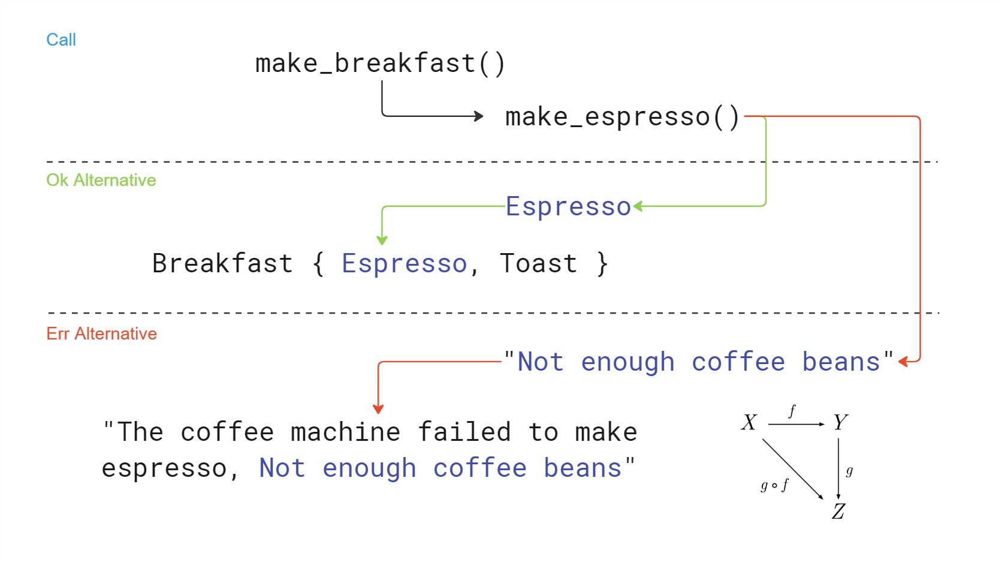
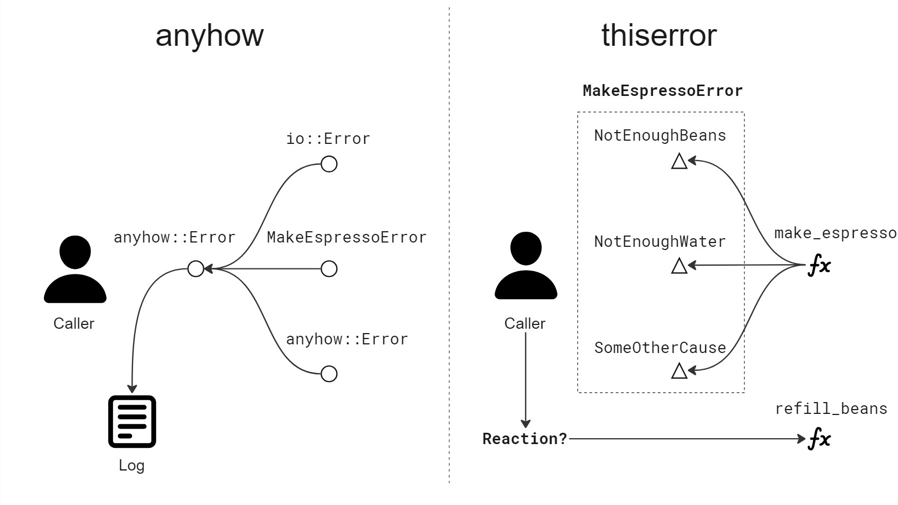

+++
title = "Error Handling in Rust, Part 2: Composability"
date = 2025-05-30
draft = true
+++

This article presents a second part of my series on Rust error handling that I started
in a [post](@/blog/rust-error-handling-part-one/index.md) three months ago. Now we'll build on that
foundation to explore composability – how to effectively combine and manage errors in more complex
Rust applications

Let's recall the simple example of making espresso in a coffee machine from the first part:

```rust
pub struct CoffeeMachine {
    water_tank_volume: f64,
    available_coffee_beans: f64,
}

impl CoffeeMachine {
    pub fn make_espresso(&self) -> Result<Espresso, String> {
        if self.water_tank_volume < 25.0 {
            Err("Not enough water in tank".to_string())
        } else if self.available_coffee_beans < 7.0 {
            Err("Not enough coffee beans".to_string())
        } else {
            Ok(Espresso {})
        }
    }
}
```

## Composing to Make Breakfast

Composition is a fundamental tool in programming and allows us to solve huge problems by breaking
them up into small puzzles that can be cracked individually. It is hard for any intelligence -
human or artificial - to reason about a complex system by observing all its moving parts. It helps
a great deal to form abstractions and build the solution layer by layer: from the small cogs to
movements and on to the whole clockwork. To show how this abstract framework can be applied to error
handling in Rust, let's consider our coffee machine a part of a larger system designed
to make breakfast:

```rust
pub struct Breakfast {
    pub espresso: Espresso,
    pub toast: Toast,
}

pub fn make_breakfast(coffee_machine: CoffeeMachine) -> Result<Breakfast, String> {
    match coffee_machine.make_espresso() {
        Ok(espresso) => Ok(Breakfast {
            espresso,
            toast: Toast {},
        }),
        Err(coffee_machine_err_str) => Err(format!(
            "The coffee machine failed to make espresso, {}",
            coffee_machine_err_str
        )),
    }
}
```

Here the task of preparing breakfast is explicitly broken down into parts. Just as we want
to compose the whole breakfast out of toast and espresso, we want to compose
the error reported from the `make_breakfast` function from information provided by any of the inner
functions representing individual steps. To do this, we match on the return value of `make_espresso`
and when get a string from the error variant, we form a new string stating what went wrong with
the inner error string appended. This is illustrated by the following diagram



This appoach allows us to propagate information about causes which is useful if it affects how the
error is handled for example.

## Building Composable Error Types

In the above example we used `String` as the error type and composed it manually like this:

```rust
        Err(coffee_machine_err_str) => Err(format!(
            "The coffee machine failed to make espresso, {}",
            coffee_machine_err_str
        )),
```

Now this would get very tedious in a real world codebase. We only used it to demonstrate the concept
and will now look at better alternatives. Let's peek inside the standard library. The first thing
we see is the following [`std::error::Error`](https://doc.rust-lang.org/std/error/trait.Error.html)
trait declaration (I ommited the deprecated methods):

```rust
pub trait Error: Debug + Display {
    fn source(&self) -> Option<&(dyn Error + 'static)> { ... }
    fn provide<'a>(&'a self, request: &mut Request<'a>) { ... }
}
```

The standard library says that this trait defines basic expectations for error values. They
must describe themselves through `Debug` and `Display` traits and may provide cause information
through `Error::source()`. Here is a quote

> Error::source() is generally used when errors cross “abstraction boundaries”. If one module must
> report an error that is caused by an error from a lower-level module, it can allow accessing
> that error via Error::source(). This makes it possible for the high-level module to provide its
> own errors while also revealing some of the implementation for debugging.

1. Implement `std::error:Error` trait yourself
2. Adopt a general-purpose error type from a crate like `anyhow`
3. Use a crate like `thiserror` to auto-implement `std::error:Error`

There is no _right strategy_, you should pick what suits your code

## Fanning out with `thiserror`

```rust
use thiserror::Error;

#[derive(PartialEq, Debug, Error)]
pub enum MakeEspressoError {
    #[error("Not enough water in tank")]
    NotEnoughWater,
    #[error("Not enough coffee beans")]
    NotEnoughBeans,
}

impl CoffeeMachine {
    pub fn make_espresso(&self) -> Result<Espresso, MakeEspressoError> {
        if self.water_tank_volume < 25.0 {
            Err(MakeEspressoError::NotEnoughWater)
        } else if self.available_coffee_beans < 7.0 {
            Err(MakeEspressoError::NotEnoughBeans)
        } else {
            Ok(Espresso {})
        }
    }
}
```

```rust
#[derive(PartialEq, Debug, Error)]
pub enum MakeBreakfastError {
    #[error("Unable to make espresso, {0}")]
    UnableToMakeEspresso(#[from] MakeEspressoError),
    #[error("Unable to make toast")]
    UnableToMakeToast,
}

pub fn make_breakfast(coffee_machine: CoffeeMachine) -> Result<Breakfast, MakeBreakfastError> {
    Ok(Breakfast {
        espresso: coffee_machine.make_espresso()?,
        toast: Toast {},
    })
}
```

- `thiserror` macros take care of `std::error::Error` implementation and composability. _Warning_: Consider potential breach of encapsulation.
- The question mark `?` operator simplifies code and improves readability

```rust
    #[test]
    fn error_returned_when_making_breakfast_without_beans() {
        let coffee_machine = CoffeeMachine {
            water_tank_volume: 300.0,
            available_coffee_beans: 2.0,
        };

        let result = make_breakfast(coffee_machine);
        assert!(result.is_err());
        assert_eq!(
            result,
            Err(MakeBreakfastError::UnableToMakeEspresso(
                MakeEspressoError::NotEnoughBeans
            ))
        );

        println!("{}", result.unwrap_err());
    }
```

```txt
Unable to make espresso, Not enough coffee beans
```

## Folding in with `anyhow`

```rust
use anyhow::{anyhow, Context, Result};

impl CoffeeMachine {
    pub fn make_espresso(&self) -> Result<Espresso> {
        if self.water_tank_volume < 25.0 {
            Err(anyhow!("Not enough water in tank"))
        } else if self.available_coffee_beans < 7.0 {
            Err(anyhow!("Not enough coffee beans"))
        } else {
            Ok(Espresso {})
        }
    }
}
```

```rust
pub fn make_breakfast(coffee_machine: CoffeeMachine) -> Result<Breakfast> {
    let espresso = coffee_machine
        .make_espresso()
        .context("Unable to make espresso")?;

    Ok(Breakfast {
        espresso,
        toast: Toast {},
    })
}
```

- Question mark operator `?` again in action
- `anyhow::context` is used to provide context for the inner error and compose error information.

```rust
    #[test]
    fn error_returned_when_making_breakfast_without_beans() {
        let coffee_machine = CoffeeMachine {
            water_tank_volume: 300.0,
            available_coffee_beans: 2.0,
        };

        let result = make_breakfast(coffee_machine);
        assert!(result.is_err());

        let err = result.unwrap_err();
        for inner in err.chain() {
            println!("{inner}");
        }
    }
```

```txt
Unable to make espresso
Not enough coffee beans
```



## Summary

- Idea of making space for error information in return value is not new
- Rust makes it easy with `Result<T, E>`
- Think about composability in error types, is it useful to you?
- Use `anyhow` as a quick start
- `anyhow` is mostly suitable for application code
- If caller needs to match on different causes, use `thiserror`
- Use `thiserror` in libraries, but you might also consider defining your own type
